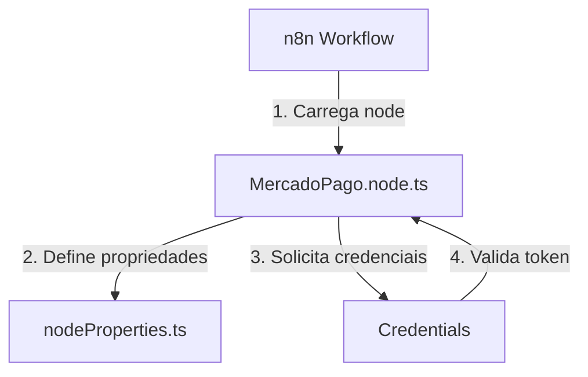
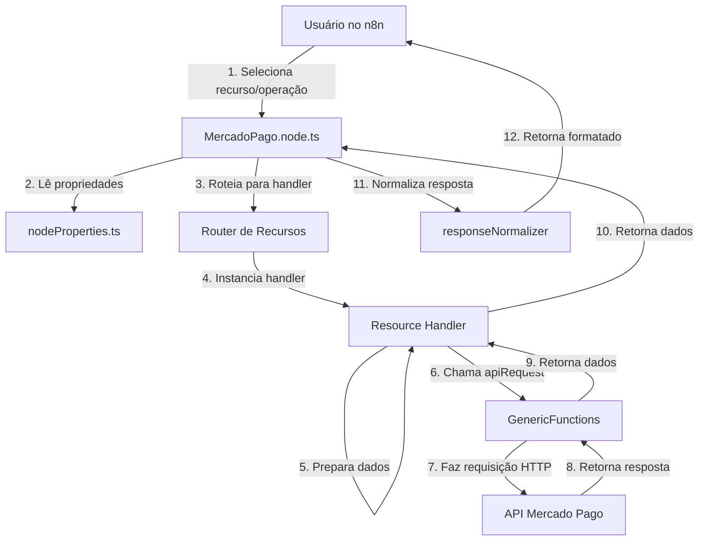
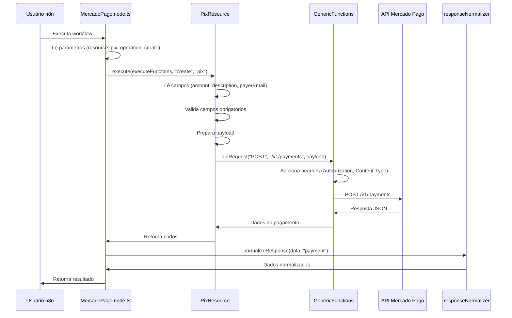
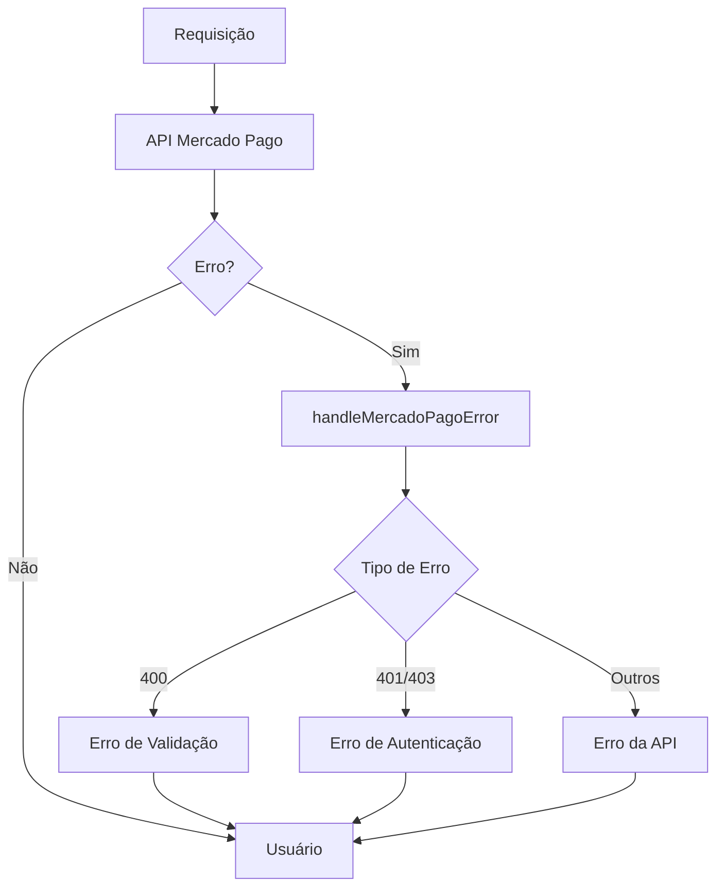

# Arquitetura do Projeto

Este documento descreve a arquitetura do node n8n para Mercado Pago, incluindo estrutura de código, fluxo de dados e decisões de design.

## 📋 Índice

- [Visão Geral](#visão-geral)
- [Estrutura de Pastas](#estrutura-de-pastas)
- [Fluxo de Execução](#fluxo-de-execução)
- [Sistema de Recursos](#sistema-de-recursos)
- [Componentes Principais](#componentes-principais)
- [Fluxo de Dados](#fluxo-de-dados)
- [Decisões de Design](#decisões-de-design)

## 🎯 Visão Geral

O projeto segue uma arquitetura modular baseada em recursos, onde cada recurso da API do Mercado Pago é implementado como um handler separado. Isso facilita manutenção, testes e extensibilidade.

### Princípios Arquiteturais

1. **Modularidade**: Cada recurso é independente
2. **Reutilização**: Funções comuns centralizadas
3. **Testabilidade**: Código facilmente testável
4. **Extensibilidade**: Fácil adicionar novos recursos
5. **Type Safety**: TypeScript estrito em todo o código

## 📁 Estrutura de Pastas

```
n8n-nodes-mercadopago-flow/
├── nodes/
│   └── MercadoPago/
│       ├── MercadoPago.node.ts          # Entry point do node
│       ├── nodeProperties.ts            # Definição de campos do n8n
│       ├── GenericFunctions.ts          # Requisições HTTP centralizadas
│       ├── helpers.ts                   # Funções utilitárias
│       ├── types.ts                     # Tipos TypeScript
│       ├── utils/
│       │   └── responseNormalizer.ts   # Normalização de respostas
│       └── resources/                  # Handlers de recursos
│           ├── ResourceHandler.ts      # Interface base
│           ├── PixResource.ts
│           ├── PlansResource.ts
│           ├── SubscriptionsResource.ts
│           └── ... (15 recursos no total)
├── credentials/
│   └── MercadoPagoApi.credentials.ts   # Definição de credenciais
├── test/                                # Testes
│   ├── unit/                           # Testes unitários
│   ├── integration/                    # Testes de integração
│   ├── local/                          # Testes locais
│   └── mocks/                          # Mocks
└── dist/                               # Build output
```

## 🔄 Fluxo de Execução

### 1. Inicialização do Node



### 2. Execução de Operação



## 🧩 Sistema de Recursos

### Interface Base

Todos os recursos implementam `IResourceHandler`:

```typescript
interface IResourceHandler {
  operations: string[]; // Lista de operações suportadas
  execute(
    executeFunctions: IExecuteFunctions,
    operation: string,
    resource: string
  ): Promise<any>;
}
```

### Exemplo de Recurso

```typescript
export class PixResource implements IResourceHandler {
  operations = ["create", "get", "refund"];

  async execute(
    executeFunctions: IExecuteFunctions,
    operation: string,
    _resource: string
  ): Promise<any> {
    switch (operation) {
      case "create":
        return await this.createPixPayment(executeFunctions, 0);
      case "get":
        return await this.getPixPayment(executeFunctions, 0);
      case "refund":
        return await this.refundPixPayment(executeFunctions, 0);
      default:
        throw new Error(`Operação "${operation}" não suportada`);
    }
  }

  private async createPixPayment(...) {
    // Implementação
  }
}
```

### Registro de Recursos

Os recursos são registrados em `MercadoPago.node.ts`:

```typescript
const resourceHandlers: Record<string, IResourceHandler> = {
  pix: new PixResource(),
  plans: new PlansResource(),
  subscriptions: new SubscriptionsResource(),
  // ... outros recursos
};
```

## 🔧 Componentes Principais

### 1. MercadoPago.node.ts

**Responsabilidades:**

- Definir descrição do node
- Rotear requisições para recursos corretos
- Normalizar respostas
- Tratar erros

**Fluxo:**

1. Recebe execução do n8n
2. Lê parâmetros (recurso, operação)
3. Busca handler do recurso
4. Executa operação
5. Normaliza resposta
6. Retorna para n8n

### 2. GenericFunctions.ts

**Funções:**

- `apiRequest()`: Requisições HTTP centralizadas
- `buildUrl()`: Construção de URLs com path parameters

**Características:**

- Tratamento de erros unificado
- Headers automáticos (Authorization, Content-Type)
- Suporte a query parameters
- Suporte a body JSON

### 3. helpers.ts

**Funções Utilitárias:**

- `validateCPF()` / `validateCNPJ()`: Validação de documentos
- `validateEmail()`: Validação de e-mail
- `normalizeAmount()`: Conversão de valores
- `cleanDocument()`: Limpeza de documentos
- `getDocumentType()`: Identificação de tipo de documento
- `handleMercadoPagoError()`: Tratamento de erros da API

### 4. responseNormalizer.ts

**Responsabilidade:**
Normalizar respostas da API para formato consistente.

**Formato Normalizado:**

```typescript
{
  id: string;
  status: string;
  amount?: number;
  currency?: string;
  createdAt?: string;
  provider: "mercado_pago";
  type: "payment" | "plan" | "subscription" | "webhook";
  raw: any;  // Resposta completa da API
}
```

### 5. nodeProperties.ts

**Responsabilidade:**
Definir todos os campos do node no n8n.

**Estrutura:**

- Seleção de recurso (dropdown)
- Seleção de operação (dinâmico baseado no recurso)
- Campos específicos por recurso/operação

## 📊 Fluxo de Dados

### Criação de Pagamento PIX



### Tratamento de Erros



## 🎨 Decisões de Design

### 1. Arquitetura Modular

**Decisão**: Cada recurso é um handler separado.

**Razão**:

- Facilita manutenção
- Permite testes isolados
- Facilita adicionar novos recursos
- Reduz acoplamento

### 2. Funções Centralizadas

**Decisão**: `GenericFunctions.ts` centraliza requisições HTTP.

**Razão**:

- Evita duplicação de código
- Tratamento de erros unificado
- Facilita mudanças futuras (ex: retry, logging)

### 3. Normalização de Respostas

**Decisão**: Todas as respostas são normalizadas.

**Razão**:

- Formato consistente no n8n
- Facilita uso em workflows
- Mantém dados completos em `raw`

### 4. TypeScript Estrito

**Decisão**: TypeScript com strict mode.

**Razão**:

- Detecção de erros em tempo de compilação
- Melhor autocomplete
- Documentação implícita via tipos
- Refatoração mais segura

### 5. Testes em Camadas

**Decisão**: Testes unitários, integração e locais.

**Razão**:

- Testes unitários: rápidos, testam lógica isolada
- Testes de integração: testam fluxo completo com mocks
- Testes locais: validação com API real

## 🔐 Segurança

### Credenciais

- Credenciais nunca são logadas
- Armazenadas de forma segura pelo n8n
- Validação de token antes de requisições

### Validação de Entrada

- Validação de CPF/CNPJ
- Validação de e-mail
- Validação de valores monetários
- Sanitização de documentos

### Tratamento de Erros

- Erros não expõem informações sensíveis
- Mensagens de erro claras para usuário
- Logs detalhados para debugging (sem dados sensíveis)

## 📈 Extensibilidade

### Adicionar Novo Recurso

1. Criar `NovoRecursoResource.ts` em `resources/`
2. Implementar `IResourceHandler`
3. Adicionar propriedades em `nodeProperties.ts`
4. Registrar em `MercadoPago.node.ts`
5. Criar testes

Veja [ADDING_NEW_RESOURCE.md](./ADDING_NEW_RESOURCE.md) para guia detalhado.

### Adicionar Nova Operação

1. Adicionar operação em `operations` do recurso
2. Adicionar case no `switch` do `execute()`
3. Implementar método privado
4. Adicionar campos em `nodeProperties.ts`
5. Criar testes

## 🔗 Referências

- [DEVELOPMENT.md](./DEVELOPMENT.md) - Guia de desenvolvimento
- [ADDING_NEW_RESOURCE.md](./ADDING_NEW_RESOURCE.md) - Como adicionar recursos
- [Documentação do n8n](https://docs.n8n.io/integrations/creating-nodes/)
- [Documentação do Mercado Pago](https://www.mercadopago.com.br/developers/pt/docs)
