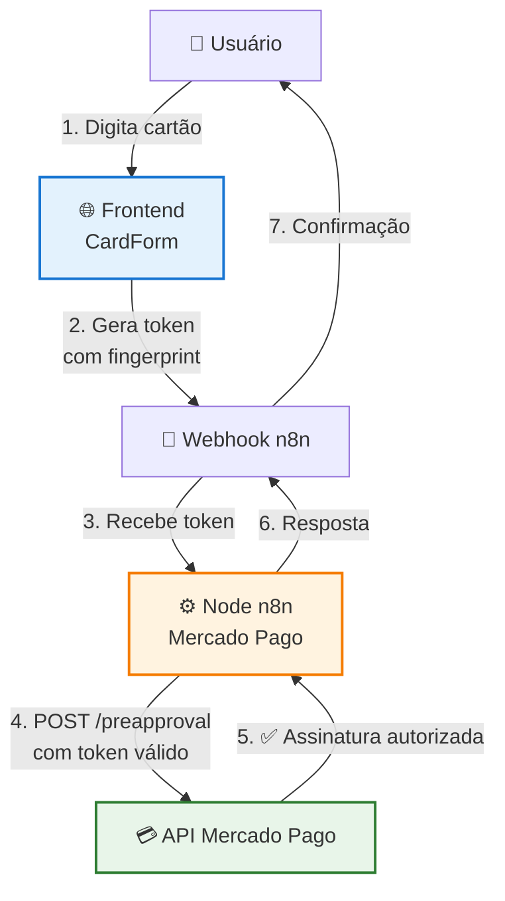
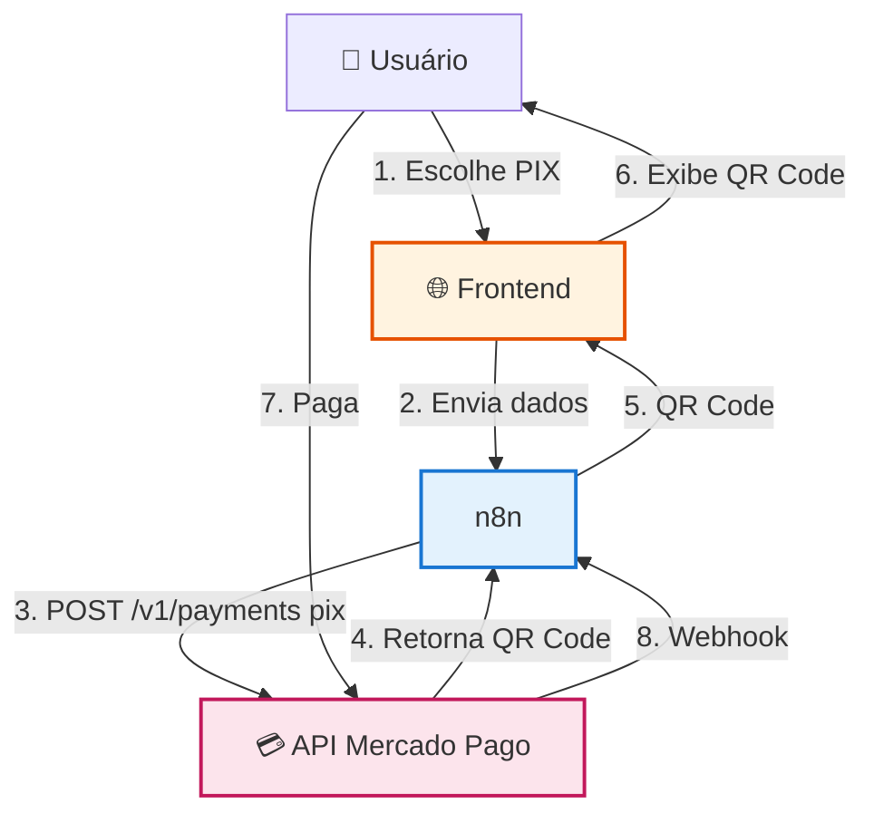

# Diagramas de Arquitetura - Mercado Pago n8n Node

Este documento apresenta diagramas visuais dos fluxos principais do node n8n para Mercado Pago.

## Regra de Ouro

- **Cartão → preapproval** (assinatura nativa)
- **PIX → payment** (recorrência manual)
- **Eles nunca se cruzam**

---

## Fluxo de Assinatura (Cartão)

Este é o único fluxo de assinatura nativa do Mercado Pago.

**Pontos Críticos:**

1. **Tokenização**: Acontece apenas no frontend, nenhum pagamento é criado ainda
2. **Criação da Assinatura**: Acontece no n8n via `POST /preapproval`
3. **Webhooks**: Você não controla a cobrança, apenas reage a ela
4. **Automação**: O Mercado Pago gerencia a recorrência automaticamente

---

## Fluxo de PIX (Recorrência Manual)

Para PIX, você é responsável pela recorrência.

**Pontos Críticos:**

1. **Sem Plano**: Nada de plano aqui, apenas pagamento único
2. **Recorrência Manual**: Você controla quando criar o próximo pagamento
3. **Assinatura Lógica**: A assinatura existe no seu sistema, não no Mercado Pago
4. **Scheduler**: Você precisa agendar a próxima cobrança

---

## Comparação Rápida

| Característica  | Assinatura (Cartão)              | PIX (Recorrência Manual)     |
| --------------- | -------------------------------- | ---------------------------- |
| **Endpoint**    | `POST /preapproval`              | `POST /v1/payments`          |
| **Plano**       | Obrigatório                      | Não existe                   |
| **Recorrência** | Automática (Mercado Pago)        | Manual (você controla)       |
| **Webhooks**    | Nativos para eventos recorrentes | Apenas para pagamento único  |
| **Tokenização** | `card_token_id` (frontend)       | Não aplicável                |
| **QR Code**     | Não aplicável                    | `qr_code` e `qr_code_base64` |
| **Controle**    | Mercado Pago gerencia            | Você gerencia                |

---

## Referências

- [Fluxo de Assinatura com Frontend](./FLUXO_ASSINATURA_FRONTEND.md) - Guia completo de implementação
- [Requisitos do Mercado Pago](./REQUISITOS_MERCADO_PAGO.md) - Informações críticas sobre requisitos
- [Documentação Oficial - Assinaturas](https://www.mercadopago.com.br/developers/pt/docs/your-integrations/subscriptions)
- [Documentação Oficial - Pagamentos PIX](https://www.mercadopago.com.br/developers/pt/docs/checkout-api/integration-test/test-cards)
