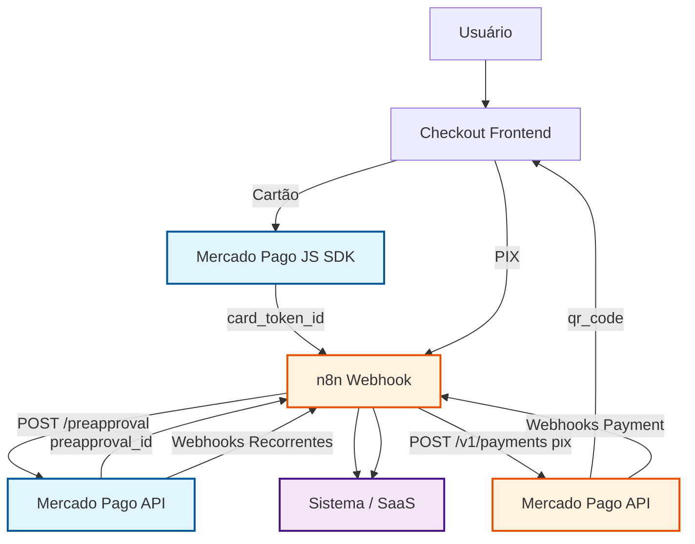
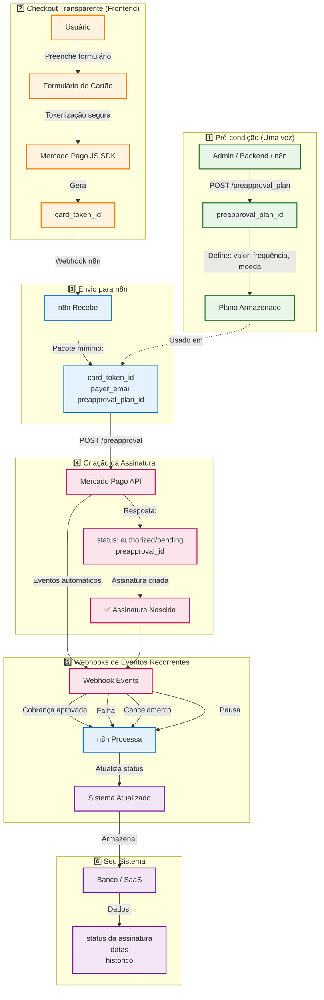
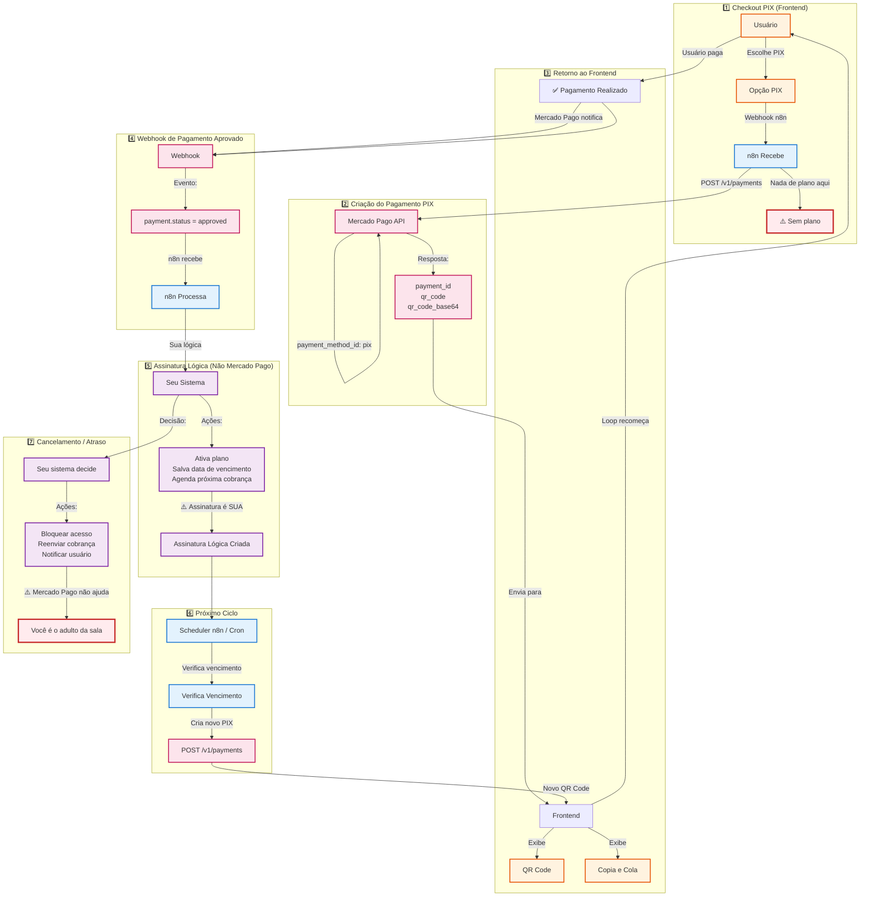
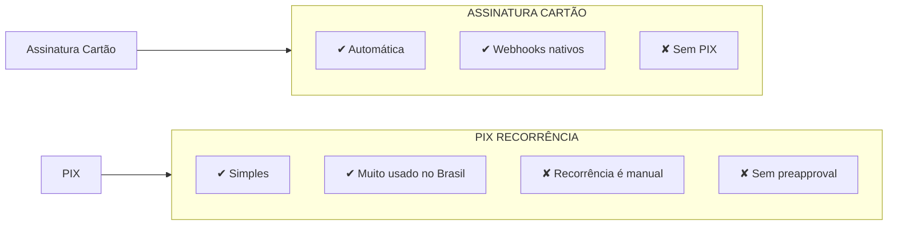
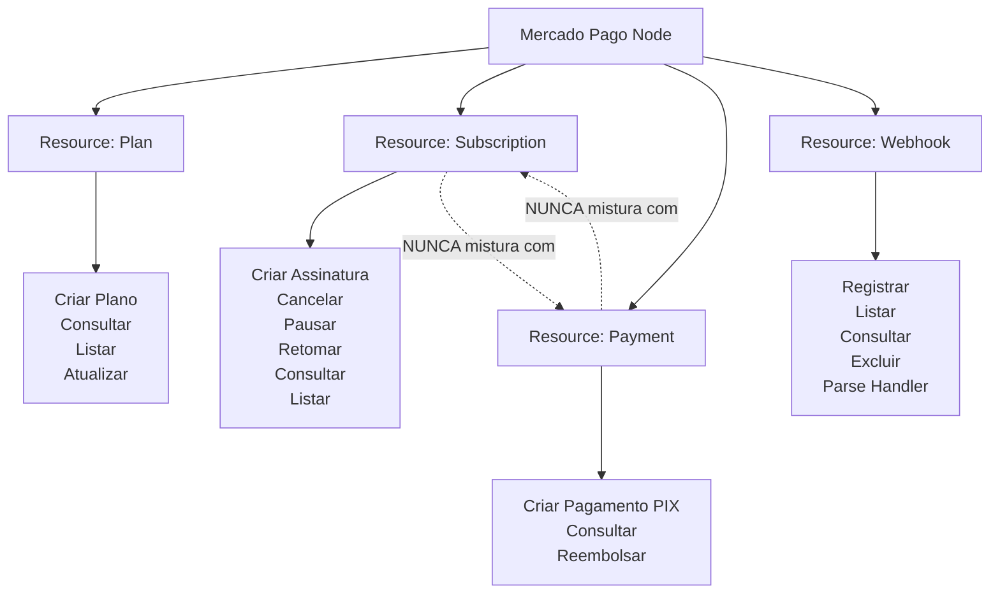
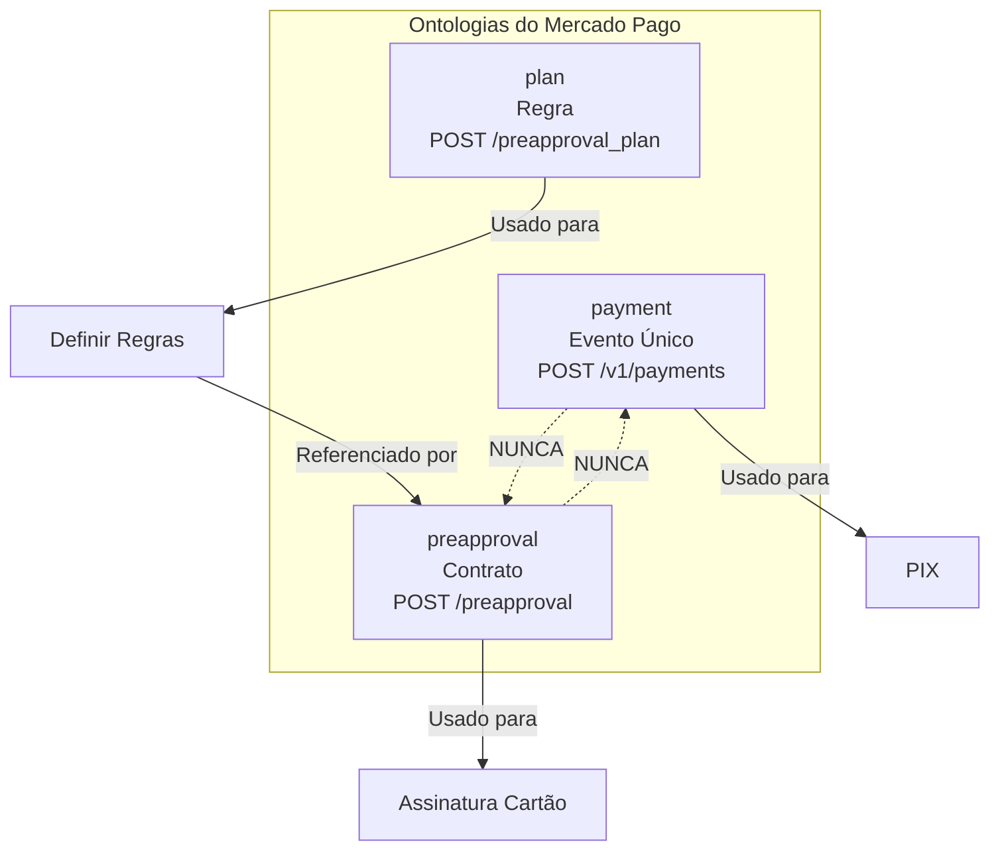

# Diagramas de Arquitetura - Mercado Pago n8n Node

Este documento apresenta a arquitetura visual completa do node n8n para Mercado Pago, mostrando como os dois universos de pagamento (Assinatura com cartão e PIX) coexistem sem se cruzar.

## Regra de Ouro Visual

- **Cartão → preapproval** (assinatura nativa)
- **PIX → payment** (recorrência manual)
- **Eles nunca se cruzam**

---

## Visão Macro - Cartão e PIX Coexistindo

**Observação**: Os dois fluxos são completamente independentes. O n8n atua como orquestrador, mas cada fluxo usa endpoints diferentes do Mercado Pago.

---

## Fluxo 1 - Assinatura Recorrente (Cartão)

Este é o único fluxo de assinatura nativa do Mercado Pago.

### Diagrama Completo

### O que NÃO existe neste fluxo

- ❌ `POST /payments` (isso é para PIX)
- ❌ PIX
- ❌ Payment ID (aqui usamos preapproval_id)

### Pontos Críticos

1. **Pré-condição**: O plano é criado UMA vez, não no checkout
2. **Tokenização**: Acontece apenas no frontend, nenhum pagamento é criado ainda
3. **Criação da Assinatura**: Acontece no n8n via `POST /preapproval`
4. **Webhooks**: Você não controla a cobrança, apenas reage a ela
5. **Automação**: O Mercado Pago gerencia a recorrência automaticamente

---

## Fluxo 2 - PIX (Recorrência Manual)

Agora entramos no território onde você é responsável pela recorrência.

### Diagrama Completo

### O que NÃO existe neste fluxo

- ❌ `preapproval_plan_id` (não há plano no Mercado Pago)
- ❌ `preapproval` (isso é para cartão)
- ❌ Recorrência automática do Mercado Pago

### Pontos Críticos

1. **Sem Plano**: Nada de plano aqui, apenas pagamento único
2. **Recorrência Manual**: Você controla quando criar o próximo pagamento
3. **Assinatura Lógica**: A assinatura existe no seu sistema, não no Mercado Pago
4. **Scheduler**: Você precisa agendar a próxima cobrança
5. **Responsabilidade**: Você é responsável por bloqueios, notificações e reenvios

---

## Comparação Final - Realidade Nua

### Tabela Comparativa

| Característica | Assinatura (Cartão) | PIX (Recorrência Manual) |
|----------------|---------------------|--------------------------|
| **Endpoint** | `POST /preapproval` | `POST /v1/payments` |
| **Plano** | Obrigatório (`preapproval_plan_id`) | Não existe |
| **Recorrência** | Automática (Mercado Pago) | Manual (você controla) |
| **Webhooks** | Nativos para eventos recorrentes | Apenas para pagamento único |
| **Tokenização** | `card_token_id` (frontend) | Não aplicável |
| **QR Code** | Não aplicável | `qr_code` e `qr_code_base64` |
| **Controle** | Mercado Pago gerencia | Você gerencia |
| **Complexidade** | Média (setup inicial) | Baixa (pagamento único) |

---

## Onde Entra o Node n8n

O node n8n expõe operações distintas, não misturadas:

### Regra Arquitetural

**Misturar "assinatura" com "payment" no mesmo caminho é pedir erro.**

Cada Resource tem sua ontologia:
- **Plan** = Regra de cobrança
- **Subscription** = Contrato recorrente (cartão)
- **Payment** = Evento único (PIX)
- **Webhook** = Notificações

---

## Pensamento Final (Arquitetura)

O Mercado Pago não é confuso. Ele é literal demais.

Cada endpoint representa uma ontologia diferente:

- `payment` = evento único
- `preapproval` = contrato
- `plan` = regra

Quando você respeita isso, tudo flui. Quando mistura, ele responde com silêncio e erro genérico.

### Diagrama de Ontologias

---

## Referências

- [Documentação Oficial - Assinaturas](https://www.mercadopago.com.br/developers/pt/docs/your-integrations/subscriptions)
- [Documentação Oficial - Pagamentos PIX](https://www.mercadopago.com.br/developers/pt/docs/checkout-api/integration-test/test-cards)
- [API Reference - Preapproval](https://www.mercadopago.com.br/developers/pt/reference/subscriptions/_preapproval/post)
- [API Reference - Payments](https://www.mercadopago.com.br/developers/pt/reference/payments/_payments/post)

