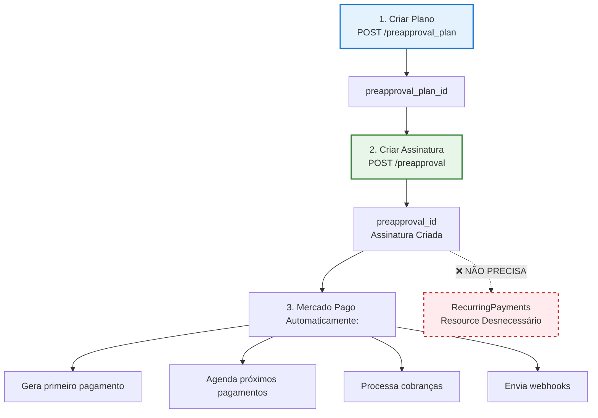

# Diferença entre Assinatura e Recorrência no Node n8n

## Resumo Executivo

**No Mercado Pago, "Assinatura" e "Pagamento Recorrente" são conceitualmente a mesma coisa**, mas no seu node n8n eles estão implementados como recursos separados. Na prática, ambos usam o mesmo endpoint da API (`/preapproval`).

---

## Resource: Subscription (Assinatura)

### O que é
Uma **assinatura** é a união entre um **plano** e um **cliente**. É o contrato que define que um cliente pagará um valor recorrente usando um cartão de crédito.

### Endpoint usado
```http
POST /preapproval          # Criar assinatura
GET  /preapproval/{id}     # Consultar assinatura
PUT  /preapproval/{id}     # Atualizar (pausar, retomar, cancelar)
GET  /preapproval/search   # Listar assinaturas
```

### Operações disponíveis
- ✅ **create** - Criar assinatura (vincula plano + cliente + cartão)
- ✅ **get** - Consultar assinatura específica
- ✅ **cancel** - Cancelar assinatura
- ✅ **pause** - Pausar assinatura temporariamente
- ✅ **resume** - Retomar assinatura pausada
- ✅ **list** - Listar todas as assinaturas

### Campos principais
- `preapproval_plan_id` - ID do plano (obrigatório)
- `payer_email` - E-mail do cliente (obrigatório)
- `card_token_id` - Token do cartão (opcional, se não fornecido retorna `init_point`)

### Como funciona
1. Você cria um **Plano** (define valor, frequência, etc.)
2. Você cria uma **Assinatura** vinculando o plano a um cliente
3. O Mercado Pago cobra automaticamente o cliente conforme a frequência do plano
4. Você recebe webhooks quando cada cobrança é processada

---

## Resource: RecurringPayments (Pagamento Recorrente)

### O que é (no código atual)
Atualmente, este resource é uma **duplicação parcial** do resource Subscription. Ele também usa o endpoint `/preapproval`, mas com funcionalidades limitadas.

### Endpoint usado
```http
GET  /preapproval/{id}     # Consultar (mesmo endpoint de Subscription)
PUT  /preapproval/{id}     # Cancelar (mesmo endpoint de Subscription)
GET  /preapproval/search   # Listar (mesmo endpoint de Subscription)
```

### Operações disponíveis
- ⚠️ **create** - **PROBLEMA**: Apenas faz GET, não cria nada!
- ✅ **get** - Consultar (mesmo que Subscription)
- ✅ **cancel** - Cancelar (mesmo que Subscription)
- ✅ **list** - Listar (mesmo que Subscription)

### Problema na implementação atual

Olhando o código de `RecurringPaymentsResource.ts`:

```typescript
private async createRecurringPayment(...) {
  const planId = executeFunctions.getNodeParameter("planId", itemIndex);
  
  // ⚠️ PROBLEMA: Isso apenas consulta, não cria!
  const response = await makeAuthenticatedRequest(
    executeFunctions,
    credentials,
    {
      method: "GET",  // GET, não POST!
      url: `${baseUrl}/preapproval/${planId}`,  // Consulta assinatura existente
    }
  );
  
  return response;
}
```

**Isso não cria um pagamento recorrente, apenas consulta uma assinatura existente!**

---

## Comparação Prática

| Característica | Subscription (Assinatura) | RecurringPayments (Recorrência) |
|----------------|---------------------------|----------------------------------|
| **Endpoint API** | `/preapproval` | `/preapproval` (mesmo!) |
| **Criar** | ✅ Funciona (POST) | ❌ Não funciona (faz GET) |
| **Consultar** | ✅ Funciona | ✅ Funciona |
| **Cancelar** | ✅ Funciona | ✅ Funciona |
| **Pausar/Retomar** | ✅ Funciona | ❌ Não disponível |
| **Listar** | ✅ Funciona | ✅ Funciona |
| **Uso recomendado** | ✅ Use este | ❌ Evite usar |

---

## Realidade da API do Mercado Pago

Na API oficial do Mercado Pago, **não existe um conceito separado de "Recurring Payments"**. 

O que existe é:
- **Plano** (`/preapproval_plan`) - Define as regras de cobrança
- **Assinatura** (`/preapproval`) - É o contrato que gera os pagamentos recorrentes automaticamente

Quando você cria uma **Assinatura**, o Mercado Pago automaticamente:
1. Cria o primeiro pagamento
2. Agenda os próximos pagamentos conforme a frequência do plano
3. Processa as cobranças automaticamente
4. Envia webhooks para cada evento

**Não há necessidade de um resource separado para "Recurring Payments"** porque a assinatura já faz isso automaticamente.

---

## Recomendação

### ✅ Use: Resource Subscription (Assinatura)

Para todos os casos de uso de pagamentos recorrentes, use o resource **Subscription**:

```typescript
// ✅ CORRETO: Criar assinatura
Resource: Subscription
Operation: create
Campos:
  - planId: "2c9380848f..."
  - payerEmail: "cliente@email.com"
  - cardTokenId: "CARD_TOKEN..." (opcional)
```

### ❌ Evite: Resource RecurringPayments

O resource **RecurringPayments** está mal implementado e é redundante:

1. **Operação create não funciona** - apenas consulta
2. **Mesmo endpoint** - usa `/preapproval` igual Subscription
3. **Funcionalidades limitadas** - não tem pause/resume
4. **Confusão conceitual** - não há diferença real na API

---

## Diagrama de Fluxo



---

## Conclusão

### Resposta Direta

**Não há diferença funcional real entre "Assinatura" e "Recorrência" no Mercado Pago.**

- Ambos usam o mesmo endpoint (`/preapproval`)
- Ambos criam o mesmo tipo de contrato
- Ambos geram pagamentos recorrentes automaticamente

### O que fazer

1. **Use sempre o Resource "Subscription"** para criar e gerenciar assinaturas
2. **Ignore o Resource "RecurringPayments"** - está mal implementado e é redundante
3. **Considere remover** o Resource "RecurringPayments" em uma futura versão para evitar confusão

### Conceito Correto

No Mercado Pago:
- **Plano** = Regra de cobrança (valor, frequência, etc.)
- **Assinatura** = Contrato que aplica o plano a um cliente e gera pagamentos recorrentes automaticamente
- **Pagamentos Recorrentes** = São gerados automaticamente pela assinatura, não precisam ser criados manualmente

---

## Referências

- [Documentação Oficial - Assinaturas](https://www.mercadopago.com.br/developers/pt/docs/your-integrations/subscriptions)
- [API Reference - Preapproval](https://www.mercadopago.com.br/developers/pt/reference/subscriptions/_preapproval/post)
- [Diagramas de Arquitetura](./DIAGRAMAS_ARQUITETURA.md)

