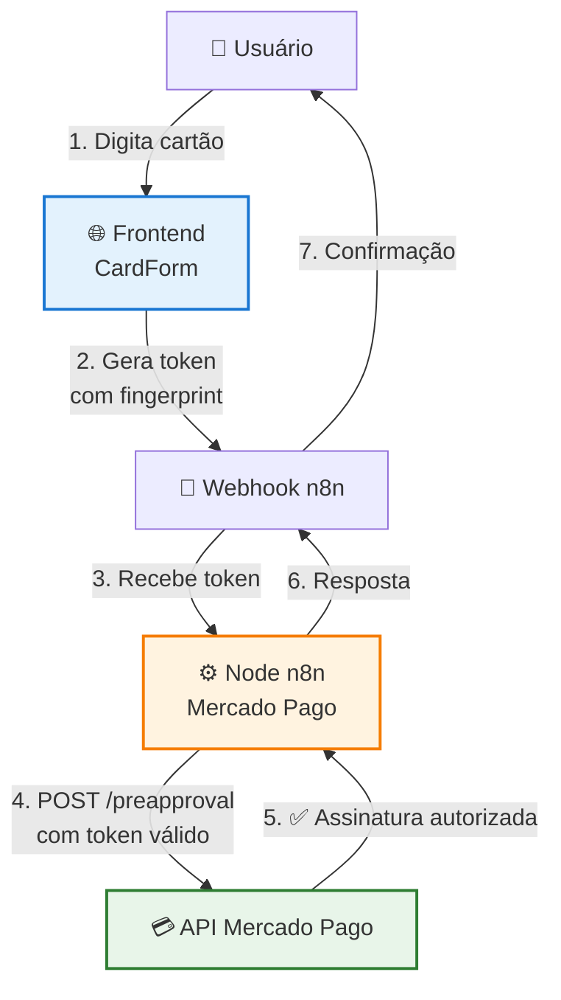

# Fluxo de Assinatura com Frontend - Guia Completo

## ⚠️ Requisito Crítico: Conta Checkout Pro

**IMPORTANTE**: Para criar assinaturas no n8n, você **DEVE** ter uma conta **Checkout Pro** no Mercado Pago.

- ✅ **Checkout Pro** → Assinaturas funcionam
- ❌ **Outros tipos de conta** → Assinaturas **NÃO funcionam**

O Checkout Pro é o único tipo de conta que suporta a criação de assinaturas recorrentes via API. Para mais detalhes, consulte [Requisitos do Mercado Pago](./REQUISITOS_MERCADO_PAGO.md).

---

## Por que Frontend é Obrigatório?

O Mercado Pago exige **prova de consentimento do pagador** para assinaturas recorrentes (preapproval). Essa prova só existe quando:

1. ✅ O cartão é digitado pelo usuário **no navegador dele**
2. ✅ Usando o **CardForm oficial** do Mercado Pago
3. ✅ Com **fingerprint do dispositivo** embutido

### O que NÃO funciona

❌ Tokens gerados via API (`POST /v1/card_tokens`)  
❌ Tokens gerados no backend  
❌ Tokens gerados via n8n  
❌ Automação 100% server-side

**Todos esses tokens são sempre recusados** pela API com erro: `"Card token service not found"`

### O que FUNCIONA

✅ Token gerado no frontend via CardForm  
✅ Fluxo: Frontend → Webhook n8n → Criar Assinatura  
✅ Arquitetura mínima com página HTML + n8n

---

## Arquitetura do Fluxo



---

## Implementação Passo a Passo

### 1. Criar Página Frontend (HTML)

Crie uma página HTML mínima que renderiza o CardForm do Mercado Pago:

```html
<!DOCTYPE html>
<html lang="pt-BR">
<head>
    <meta charset="UTF-8">
    <meta name="viewport" content="width=device-width, initial-scale=1.0">
    <title>Assinatura - Checkout</title>
    <script src="https://sdk.mercadopago.com/js/v2"></script>
</head>
<body>
    <h1>Assinar Plano</h1>
    
    <form id="form-checkout">
        <div id="form-checkout__cardNumber"></div>
        <div id="form-checkout__cardExpirationDate"></div>
        <div id="form-checkout__cardSecurityCode"></div>
        <input type="text" id="form-checkout__cardholderName" placeholder="Nome no cartão" />
        <input type="email" id="form-checkout__cardholderEmail" placeholder="E-mail" />
        <input type="text" id="form-checkout__identificationNumber" placeholder="CPF" />
        
        <input type="hidden" id="planId" value="SEU_PLAN_ID_AQUI" />
        
        <button type="submit" id="form-checkout__submit">Assinar</button>
    </form>

    <script>
        const mp = new MercadoPago('SUA_PUBLIC_KEY_AQUI', {
            locale: 'pt-BR'
        });

        const cardForm = mp.cardForm({
            amount: "49.90",
            iframe: true,
            form: {
                id: "form-checkout",
                cardNumber: {
                    id: "form-checkout__cardNumber",
                    placeholder: "Número do cartão"
                },
                expirationDate: {
                    id: "form-checkout__cardExpirationDate",
                    placeholder: "MM/AA"
                },
                securityCode: {
                    id: "form-checkout__cardSecurityCode",
                    placeholder: "Código de segurança"
                },
                cardholderName: {
                    id: "form-checkout__cardholderName",
                    placeholder: "Nome no cartão"
                },
                cardholderEmail: {
                    id: "form-checkout__cardholderEmail",
                    placeholder: "E-mail"
                },
                identificationType: {
                    id: "form-checkout__identificationType"
                },
                identificationNumber: {
                    id: "form-checkout__identificationNumber",
                    placeholder: "CPF"
                },
                installments: {
                    id: "form-checkout__installments",
                    placeholder: "Parcelas"
                },
                cardholder: {
                    id: "form-checkout__cardholder"
                }
            },
            callbacks: {
                onFormMounted: error => {
                    if (error) {
                        console.error('Erro ao montar formulário:', error);
                        return;
                    }
                    console.log('Formulário montado com sucesso');
                },
                onSubmit: async (event) => {
                    event.preventDefault();
                    
                    const {
                        token,
                        error
                    } = await cardForm.createCardToken();

                    if (error) {
                        console.error('Erro ao gerar token:', error);
                        alert('Erro ao processar cartão. Tente novamente.');
                        return;
                    }

                    console.log('Token gerado:', token);

                    // Enviar token para o webhook do n8n
                    const planId = document.getElementById('planId').value;
                    const email = document.getElementById('form-checkout__cardholderEmail').value;
                    const cpf = document.getElementById('form-checkout__identificationNumber').value;

                    try {
                        const response = await fetch('https://SEU_N8N/webhook/assinatura', {
                            method: 'POST',
                            headers: {
                                'Content-Type': 'application/json'
                            },
                            body: JSON.stringify({
                                card_token_id: token,
                                plan_id: planId,
                                payer_email: email,
                                payer_document: cpf
                            })
                        });

                        const result = await response.json();
                        
                        if (response.ok) {
                            alert('Assinatura criada com sucesso!');
                            console.log('Assinatura criada:', result);
                            // Redirecionar ou mostrar sucesso
                        } else {
                            alert('Erro ao criar assinatura: ' + (result.message || 'Erro desconhecido'));
                            console.error('Erro:', result);
                        }
                    } catch (error) {
                        console.error('Erro ao enviar para n8n:', error);
                        alert('Erro ao processar assinatura. Tente novamente.');
                    }
                },
                onFetching: (resource) => {
                    console.log('Buscando:', resource);
                }
            }
        });
    </script>
</body>
</html>
```

### 2. Configurar Webhook no n8n

Crie um workflow no n8n com:

1. **Webhook Node** (Trigger)
   - Método: POST
   - Path: `/assinatura`
   - Response Mode: "Last Node"

2. **Mercado Pago Node** (Subscription > Create)
   - Resource: Assinatura
   - Operation: Criar
   - Plan ID: `{{ $json.body.plan_id }}`
   - Payer Email: `{{ $json.body.payer_email }}`
   - Card Token ID: `{{ $json.body.card_token_id }}`
   - Payer Document: `{{ $json.body.payer_document }}`
   - Subscription Status: `authorized`

3. **Respond to Webhook Node** (Opcional)
   - Retorna sucesso ou erro

### 3. Exemplo de Workflow n8n

```json
{
  "nodes": [
    {
      "name": "Webhook",
      "type": "n8n-nodes-base.webhook",
      "parameters": {
        "httpMethod": "POST",
        "path": "assinatura",
        "responseMode": "lastNode"
      }
    },
    {
      "name": "Mercado Pago - Criar Assinatura",
      "type": "n8n-nodes-mercadopago-flow.mercadoPago",
      "parameters": {
        "resource": "subscriptions",
        "operation": "create",
        "planId": "={{ $json.body.plan_id }}",
        "payerEmail": "={{ $json.body.payer_email }}",
        "cardTokenId": "={{ $json.body.card_token_id }}",
        "payerDocument": "={{ $json.body.payer_document }}",
        "subscriptionStatus": "authorized"
      }
    }
  ]
}
```

---

## Fluxo Completo Detalhado

### Passo 1: Usuário acessa página de checkout

O usuário acessa sua página HTML que contém o CardForm.

### Passo 2: Usuário digita dados do cartão

O CardForm captura os dados diretamente no navegador do usuário.

### Passo 3: Frontend gera token

Quando o usuário submete o formulário, o CardForm gera um token com:
- Dados do cartão (criptografados)
- Fingerprint do dispositivo
- Prova de consentimento do usuário

### Passo 4: Frontend envia token para n8n

O frontend faz uma requisição POST para o webhook do n8n com:
```json
{
  "card_token_id": "abc123def456...",
  "plan_id": "2c9380848f...",
  "payer_email": "cliente@email.com",
  "payer_document": "12345678909"
}
```

### Passo 5: n8n cria assinatura

O node n8n recebe o token e cria a assinatura via API:
```http
POST /preapproval
{
  "preapproval_plan_id": "2c9380848f...",
  "payer_email": "cliente@email.com",
  "card_token_id": "abc123def456...",
  "status": "authorized"
}
```

### Passo 6: Mercado Pago autoriza

A API do Mercado Pago valida o token (com fingerprint) e autoriza a assinatura.

### Passo 7: Resposta para usuário

O n8n retorna sucesso e o frontend mostra confirmação ao usuário.

---

## Arquitetura Mínima Funcional

### Opção 1: Página HTML Simples

- Uma página HTML servida por qualquer servidor web
- Pode ser hospedada no GitHub Pages, Netlify, Vercel, etc.
- Não precisa de backend próprio

### Opção 2: Integração com Seu SaaS

- Seu frontend (React, Vue, etc.) renderiza o CardForm
- Envia token para seu backend
- Seu backend chama n8n via webhook ou API

### Opção 3: n8n como Servidor Web

- Use o n8n para servir uma página HTML simples
- Crie um workflow que retorna HTML no webhook
- Mesmo domínio para frontend e webhook

---

## Como Enviar Dados para n8n

### Opção 1: Via Webhook do n8n (Recomendado)

O n8n permite criar workflows que são acionados via webhook HTTP.

1. **Crie um workflow no n8n** com um nó "Webhook"
2. **Configure o webhook** para receber POST requests
3. **Adicione o node Mercado Pago** após o webhook
4. **Configure o node** para usar os dados recebidos do webhook
5. **Obtenha a URL do webhook** do n8n
6. **Envie dados do front-end** para essa URL

**Exemplo de código JavaScript no front-end:**

```javascript
async function enviarParaN8n(dados) {
  const webhookUrl = 'https://seu-n8n.com/webhook/assinatura';
  
  const response = await fetch(webhookUrl, {
    method: 'POST',
    headers: {
      'Content-Type': 'application/json',
    },
    body: JSON.stringify(dados),
  });
  
  const resultado = await response.json();
  return resultado;
}

// Exemplo de uso para Assinatura
const dadosAssinatura = {
  resource: 'subscriptions',
  operation: 'create',
  planId: '2c938084726fca480172750000000000',
  payerEmail: 'cliente@exemplo.com',
  payerDocument: '12345678909',
  cardTokenId: 'abc123def456...', // Obtido do CardForm
  subscriptionStatus: 'authorized',
};

const resultado = await enviarParaN8n(dadosAssinatura);
console.log('Assinatura criada:', resultado);
```

### Opção 2: Via HTTP Request (API do n8n)

Se você tiver acesso à API do n8n, pode executar workflows diretamente.

**Exemplo:**

```javascript
async function executarWorkflowN8n(dados) {
  const apiUrl = 'https://seu-n8n.com/api/v1/workflows/WORKFLOW_ID/execute';
  const apiKey = 'SUA_API_KEY';
  
  const response = await fetch(apiUrl, {
    method: 'POST',
    headers: {
      'Content-Type': 'application/json',
      'X-N8N-API-KEY': apiKey,
    },
    body: JSON.stringify({
      data: [dados],
    }),
  });
  
  return await response.json();
}
```

---

## Tratamento de Respostas

### Resposta de Assinatura (com card_token_id)

```json
{
  "id": "2c938084726fca480172750000000000",
  "status": "authorized",
  "payerEmail": "cliente@exemplo.com",
  "planId": "2c938084726fca480172750000000000",
  "nextPaymentDate": "2024-02-01T00:00:00.000Z",
  "createdAt": "2024-01-01T12:00:00.000Z"
}
```

**O que fazer:**
1. Confirme que `status` é "authorized"
2. Exiba mensagem de sucesso
3. Ative acesso do cliente ao serviço
4. Configure webhook para monitorar mudanças

### Resposta de Assinatura (sem card_token_id)

```json
{
  "id": "2c938084726fca480172750000000000",
  "status": "pending",
  "initPoint": "https://www.mercadopago.com.br/subscriptions/checkout?preapproval_id=2c938084726fca480172750000000000",
  "payerEmail": "cliente@exemplo.com",
  "planId": "2c938084726fca480172750000000000",
  "createdAt": "2024-01-01T12:00:00.000Z"
}
```

**O que fazer:**
1. Use `initPoint` para redirecionar o cliente
2. Ou exiba um botão/link para o cliente acessar
3. Configure webhook para ser notificado quando status mudar para "authorized"

---

## Exemplo de Código Frontend (React)

```jsx
import { useEffect, useRef } from 'react';

function CheckoutForm({ planId, publicKey }) {
    const cardFormRef = useRef(null);

    useEffect(() => {
        const mp = new window.MercadoPago(publicKey, {
            locale: 'pt-BR'
        });

        const cardForm = mp.cardForm({
            amount: "49.90",
            iframe: true,
            form: {
                id: "form-checkout",
                // ... configuração do formulário
            },
            callbacks: {
                onSubmit: async (event) => {
                    event.preventDefault();
                    const { token, error } = await cardForm.createCardToken();
                    
                    if (error) {
                        console.error(error);
                        return;
                    }

                    // Enviar para n8n
                    await fetch('https://seu-n8n.com/webhook/assinatura', {
                        method: 'POST',
                        headers: { 'Content-Type': 'application/json' },
                        body: JSON.stringify({
                            card_token_id: token,
                            plan_id: planId,
                            payer_email: email,
                            payer_document: cpf
                        })
                    });
                }
            }
        });

        cardFormRef.current = cardForm;

        return () => {
            // Cleanup se necessário
        };
    }, [publicKey, planId]);

    return (
        <form id="form-checkout">
            <div id="form-checkout__cardNumber"></div>
            <div id="form-checkout__cardExpirationDate"></div>
            <div id="form-checkout__cardSecurityCode"></div>
            {/* ... outros campos */}
        </form>
    );
}
```

---

## Testes

### ⚠️ Compatibilidade de Ambiente

**IMPORTANTE**: A PUBLIC_KEY usada no frontend e o Access Token usado no backend **DEVEM estar no mesmo ambiente** (sandbox ou produção).

Tokens gerados com PUBLIC_KEY de um ambiente não funcionam com Access Token de outro ambiente. Isso causará erro `CC_VAL_433`.

Para mais detalhes, consulte: [Compatibilidade de Ambiente](./COMPATIBILIDADE_AMBIENTE.md)

### Ambiente Sandbox

1. Use a **PUBLIC_KEY** do ambiente sandbox
2. Use o **Access Token** do ambiente sandbox (configure `MP_ENVIRONMENT=sandbox` no `.env`)
2. Use cartões de teste do Mercado Pago:
   - Mastercard: `5031 4332 1540 6351`
   - CVV: `123`
   - Vencimento: `11/30`
   - Nome: `APRO` (para aprovação)

### Validação

- ✅ Token gerado no frontend funciona
- ✅ Assinatura é criada com status "authorized"
- ✅ Webhook recebe notificações de cobrança

---

## Troubleshooting

### Erro: "Card token service not found"

**Causa**: Token foi gerado via API ou backend, não no frontend.

**Solução**: Use CardForm no frontend. Tokens gerados via `/v1/card_tokens` não funcionam para assinaturas.

### Erro: "Token inválido"

**Causa**: Token expirou ou foi usado mais de uma vez.

**Solução**: Gere um novo token no frontend para cada tentativa.

### Erro: "Preapproval plan not found"

**Causa**: Plan ID incorreto ou plano não existe.

**Solução**: Verifique se o Plan ID está correto e se o plano foi criado.

### Erro: "CC_VAL_433 Credit card validation has failed"

**Causa**: Incompatibilidade de ambiente entre PUBLIC_KEY e Access Token.

**Solução**: 
- Verifique se a PUBLIC_KEY usada no frontend está no mesmo ambiente do Access Token
- Execute `npm run frontend:config` para validar compatibilidade
- Consulte [Compatibilidade de Ambiente](./COMPATIBILIDADE_AMBIENTE.md) para mais detalhes

---

## Conclusão

**Não existe atalho**: Assinaturas no Mercado Pago **exigem frontend** com CardForm. Isso não é uma limitação do node n8n, mas uma **exigência de segurança** do Mercado Pago para proteger o consentimento do pagador.

O node n8n está funcionando corretamente. O que falta é a **ponte frontend** que gera o token válido.

---

## Dúvidas Frequentes

### Posso coletar dados do cartão diretamente no n8n?

**Não recomendado**. Por questões de segurança PCI, os dados do cartão devem ser coletados no front-end usando o CardForm do MercadoPago.js. O n8n recebe apenas o `card_token_id` já tokenizado.

### O que acontece se eu não enviar card_token_id?

A assinatura será criada com `status: "pending"` e você receberá um `init_point` (URL) para o cliente completar o pagamento no checkout do Mercado Pago.

### Como monitorar mudanças de status?

Configure webhooks no Mercado Pago para receber notificações quando o status da assinatura mudar. Veja [Webhooks para Assinaturas](./WEBHOOKS_ASSINATURAS.md).

### O card_token_id expira?

Sim, o token expira em 7 dias e pode ser usado apenas uma vez. Se precisar criar outra assinatura, gere um novo token.

### Preciso ter Checkout Pro para criar assinaturas?

**Sim, obrigatório**. Apenas contas Checkout Pro podem criar assinaturas. Veja [Requisitos do Mercado Pago](./REQUISITOS_MERCADO_PAGO.md) para mais detalhes.

---

## Referências

- [Requisitos do Mercado Pago](./REQUISITOS_MERCADO_PAGO.md) - Informações críticas sobre requisitos
- [Como Obter card_token_id](./COMO_OBTER_CARD_TOKEN.md) - Guia passo a passo
- [Webhooks para Assinaturas](./WEBHOOKS_ASSINATURAS.md) - Configuração de webhooks
- [Compatibilidade de Ambiente](./COMPATIBILIDADE_AMBIENTE.md) - Compatibilidade entre ambientes
- [Guia de Campos](./GUIA_CAMPOS.md) - Referência completa de campos
- [Documentação Oficial - Checkout Transparente](https://www.mercadopago.com.br/developers/pt/docs/checkout-api/integration-test/test-cards)
- [CardForm - Mercado Pago](https://www.mercadopago.com.br/developers/pt/docs/checkout-api/integration-configuration/integrate-cardform)
- [API de Assinaturas](https://www.mercadopago.com.br/developers/pt/reference/subscriptions/_preapproval/post)

