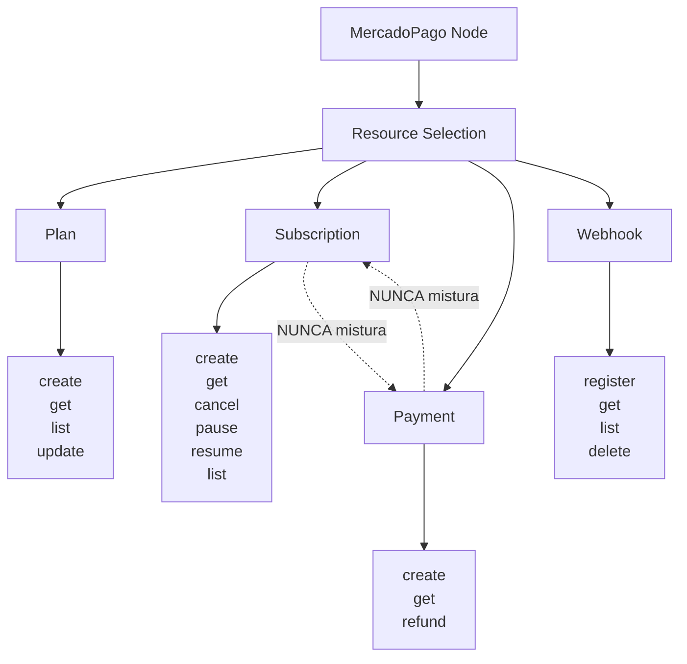

# Schema do Node n8n - Mercado Pago

Este documento apresenta a modelagem completa do schema do node n8n para Mercado Pago, incluindo estrutura lógica, campos por operação e formato de output normalizado.

## Regra Arquitetural Fundamental

**Misturar "assinatura" com "payment" no mesmo caminho é pedir erro.**

Cada Resource tem sua ontologia:
- **Plan** = Regra de cobrança
- **Subscription** = Contrato recorrente (cartão)
- **Payment** = Evento único (PIX)
- **Webhook** = Notificações

---

## Estrutura Lógica do Node



### Hierarquia de Resources

```
MercadoPago
├─ Resource
│  ├─ Plan
│  ├─ Subscription
│  ├─ Payment (PIX)
│  └─ Webhook
│
├─ Operations
│  ├─ create
│  ├─ get
│  ├─ cancel
│  ├─ list
│  ├─ update (apenas Plan)
│  ├─ pause (apenas Subscription)
│  ├─ resume (apenas Subscription)
│  ├─ refund (apenas Payment)
│  └─ delete (apenas Webhook)
```

---

## Resource: PLAN

### Operation: create

#### Campos Obrigatórios

| Campo (n8n) | Nome API | Tipo | Descrição |
|-------------|----------|------|-----------|
| `reason` | `reason` | string | Nome/descrição do plano |
| `amount` | `auto_recurring.transaction_amount` | number | Valor do plano em reais (ex: 49.90) |
| `frequency` | `auto_recurring.frequency` | number | Frequência de cobrança (ex: 1 para mensal) |
| `frequencyType` | `auto_recurring.frequency_type` | options | Tipo: "days" ou "months" |
| `currencyId` | `auto_recurring.currency_id` | options | Moeda (BRL, ARS, CLP, MXN, COP, PEN, UYU) |
| `backUrl` | `back_url` | string | URL de retorno após checkout |

#### Campos Opcionais

| Campo (n8n) | Nome API | Tipo | Descrição |
|-------------|----------|------|-----------|
| `repetitions` | `auto_recurring.repetitions` | number | Número de ciclos (0 = ilimitado) |
| `billingDay` | `auto_recurring.billing_day` | number | Dia do mês (1-28) para cobrança |
| `billingDayProportional` | `auto_recurring.billing_day_proportional` | boolean | Cobrança proporcional no primeiro ciclo |
| `freeTrialFrequency` | `auto_recurring.free_trial.frequency` | number | Frequência do trial grátis |
| `freeTrialFrequencyType` | `auto_recurring.free_trial.frequency_type` | options | Tipo: "days" ou "months" |
| `paymentTypes` | `payment_methods_allowed.payment_types` | multiOptions | Tipos: credit_card, debit_card |
| `paymentMethods` | `payment_methods_allowed.payment_methods` | multiOptions | Métodos: visa, mastercard, amex, etc. |

#### Output Esperado

```json
{
  "id": "2c9380848f...",
  "status": "active",
  "planId": "2c9380848f...",
  "amount": 49.90,
  "description": "Plano Pro Mensal",
  "createdAt": "2024-01-01T12:00:00.000-03:00",
  "raw": {
    "id": "2c9380848f...",
    "status": "active",
    "reason": "Plano Pro Mensal",
    "auto_recurring": {
      "frequency": 1,
      "frequency_type": "months",
      "transaction_amount": 49.90,
      "currency_id": "BRL"
    },
    "init_point": "https://www.mercadopago.com.br/subscriptions/checkout?preapproval_plan_id=2c9380848f...",
    "sandbox_init_point": "https://sandbox.mercadopago.com.br/subscriptions/checkout?preapproval_plan_id=2c9380848f..."
  }
}
```

**Campo crítico**: `id` → `preapproval_plan_id` usado para criar assinaturas.

### Operation: get

#### Campos Obrigatórios

| Campo (n8n) | Nome API | Tipo | Descrição |
|-------------|----------|------|-----------|
| `planId` | `{id}` | string | ID do plano a consultar |

### Operation: list

Sem campos obrigatórios. Retorna lista de todos os planos.

### Operation: update

#### Campos Obrigatórios

| Campo (n8n) | Nome API | Tipo | Descrição |
|-------------|----------|------|-----------|
| `planId` | `{id}` | string | ID do plano a atualizar |

#### Campos Opcionais (pelo menos um obrigatório)

| Campo (n8n) | Nome API | Tipo | Descrição |
|-------------|----------|------|-----------|
| `updateReason` | `reason` | string | Novo nome do plano |
| `updateAmount` | `auto_recurring.transaction_amount` | number | Novo valor do plano |

---

## Resource: SUBSCRIPTION

### ⚠️ IMPORTANTE: Token DEVE ser Gerado no Frontend

**CRÍTICO**: O campo `cardTokenId` **DEVE ser gerado no frontend** usando o CardForm oficial do Mercado Pago.

**Tokens gerados via API (`/v1/card_tokens`) NÃO funcionam** para assinaturas e serão sempre recusados pela API com erro `"Card token service not found"`.

**Veja**: [Fluxo de Assinatura com Frontend](./FLUXO_ASSINATURA_FRONTEND.md) para implementação completa.

### Operation: create

#### Campos Obrigatórios

| Campo (n8n) | Nome API | Tipo | Descrição |
|-------------|----------|------|-----------|
| `planId` | `preapproval_plan_id` | string | ID do plano (obtido ao criar plano) |
| `payerEmail` | `payer_email` | string | E-mail do pagador |

#### Campos Opcionais

| Campo (n8n) | Nome API | Tipo | Descrição |
|-------------|----------|------|-----------|
| `payerDocument` | `payer.identification.number` | string | CPF/CNPJ do pagador |
| `startDate` | `start_date` | dateTime | Data de início da assinatura |
| `trialPeriodDays` | `trial_period_days` | number | Período de trial em dias |
| `cardTokenId` | `card_token_id` | string | **⚠️ Token do cartão gerado no FRONTEND via CardForm. Tokens gerados via API não funcionam.** |
| `subscriptionStatus` | `status` | options | "pending" ou "authorized" |
| `backUrl` | `back_url` | string | URL de retorno após checkout |
| `reason` | `reason` | string | Descrição da assinatura |
| `externalReference` | `external_reference` | string | Referência externa para rastreamento |

#### Regras Internas

1. **Se `cardTokenId` fornecido**:
   - Status automaticamente definido como `authorized`
   - Assinatura ativa imediatamente
   - Campo `subscriptionStatus` ignorado
   - **Token DEVE ter sido gerado no frontend via CardForm**

2. **Se `cardTokenId` NÃO fornecido**:
   - Status definido como `pending`
   - Retorna `init_point` para checkout
   - Campo `subscriptionStatus` pode ser usado para forçar `pending`
   - **Nota**: A API pode exigir token mesmo para pending (depende da configuração do plano)

3. **Validação de Token**:
   - Se status = "authorized" e `cardTokenId` ausente → Erro
   - **Token deve ser obtido no frontend via Mercado Pago JS SDK (CardForm)**
   - Tokens gerados via API serão recusados

4. **Esconder se método = PIX**:
   - Este Resource NÃO deve ser usado para PIX
   - PIX usa Resource: Payment

#### Output Esperado (Com Cartão)

```json
{
  "id": "2c9380849a...",
  "status": "authorized",
  "planId": "2c9380848f...",
  "payerEmail": "cliente@email.com",
  "createdAt": "2024-01-01T12:00:00.000-03:00",
  "raw": {
    "id": "2c9380849a...",
    "status": "authorized",
    "preapproval_plan_id": "2c9380848f...",
    "payer_email": "cliente@email.com",
    "card_token_id": "CARD_TOKEN_GERADO_NO_FRONT",
    "init_point": null,
    "sandbox_init_point": null
  }
}
```

#### Output Esperado (Sem Cartão - Pending)

```json
{
  "id": "2c9380849a...",
  "status": "pending",
  "planId": "2c9380848f...",
  "payerEmail": "cliente@email.com",
  "url": "https://www.mercadopago.com.br/subscriptions/checkout?preapproval_id=2c9380849a...",
  "createdAt": "2024-01-01T12:00:00.000-03:00",
  "raw": {
    "id": "2c9380849a...",
    "status": "pending",
    "preapproval_plan_id": "2c9380848f...",
    "payer_email": "cliente@email.com",
    "init_point": "https://www.mercadopago.com.br/subscriptions/checkout?preapproval_id=2c9380849a...",
    "sandbox_init_point": "https://sandbox.mercadopago.com.br/subscriptions/checkout?preapproval_id=2c9380849a..."
  }
}
```

**Campo crítico**: `id` → `preapproval_id` usado para gerenciar a assinatura.

### Operation: cancel

#### Campos Obrigatórios

| Campo (n8n) | Nome API | Tipo | Descrição |
|-------------|----------|------|-----------|
| `subscriptionId` | `{id}` | string | ID da assinatura a cancelar |

**⚠️ Atenção**: Cancelamento é irreversível.

### Operation: pause

#### Campos Obrigatórios

| Campo (n8n) | Nome API | Tipo | Descrição |
|-------------|----------|------|-----------|
| `subscriptionId` | `{id}` | string | ID da assinatura a pausar |

### Operation: resume

#### Campos Obrigatórios

| Campo (n8n) | Nome API | Tipo | Descrição |
|-------------|----------|------|-----------|
| `subscriptionId` | `{id}` | string | ID da assinatura a retomar |

### Operation: get

#### Campos Obrigatórios

| Campo (n8n) | Nome API | Tipo | Descrição |
|-------------|----------|------|-----------|
| `subscriptionId` | `{id}` | string | ID da assinatura a consultar |

### Operation: list

Sem campos obrigatórios. Retorna lista de todas as assinaturas.

---

## Resource: PAYMENT (PIX)

### Operation: create

#### Campos Obrigatórios

| Campo (n8n) | Nome API | Tipo | Descrição |
|-------------|----------|------|-----------|
| `amount` | `transaction_amount` | number | Valor do pagamento em reais (ex: 49.90) |
| `description` | `description` | string | Descrição do pagamento |
| `payerEmail` | `payer.email` | string | E-mail do pagador |

#### Campos Opcionais

| Campo (n8n) | Nome API | Tipo | Descrição |
|-------------|----------|------|-----------|
| `payerDocument` | `payer.identification.number` | string | CPF/CNPJ do pagador |
| `payerName` | `payer.first_name` / `payer.last_name` | string | Nome completo do pagador |
| `expirationDate` | `date_of_expiration` | dateTime | Data de expiração do QR Code |
| `externalReference` | `external_reference` | string | Referência externa |
| `idempotencyKey` | `X-Idempotency-Key` (header) | string | Chave de idempotência |

#### Regras Internas

1. **Se método = PIX**:
   - ❌ NÃO mostrar campos de cartão
   - ❌ NÃO mostrar campos de plano
   - ✅ Mostrar apenas campos de PIX

2. **Validação**:
   - Valor deve ser > 0
   - E-mail deve ser válido
   - CPF/CNPJ deve ter formato válido (11 ou 14 dígitos)

3. **Idempotência**:
   - Se `idempotencyKey` fornecido, enviado como header
   - Garante que requisições duplicadas não criem pagamentos duplicados

#### Output Esperado

```json
{
  "id": "123456789",
  "status": "pending",
  "amount": 49.90,
  "currency": "BRL",
  "description": "Plano Pro - Mensal",
  "payerEmail": "cliente@email.com",
  "qrCode": "00020126360014BR.GOV.BCB.PIX0114+55119999999995204000053039865802BR5913FULANO DE TAL6008BRASILIA62070503***6304ABCD",
  "qrCodeBase64": "iVBORw0KGgoAAAANSUhEUgAA...",
  "createdAt": "2024-01-01T12:00:00.000-03:00",
  "raw": {
    "id": 123456789,
    "status": "pending",
    "status_detail": "pending_waiting_transfer",
    "transaction_amount": 49.90,
    "currency_id": "BRL",
    "description": "Plano Pro - Mensal",
    "payment_method_id": "pix",
    "payer": {
      "email": "cliente@email.com"
    },
    "point_of_interaction": {
      "transaction_data": {
        "qr_code": "00020126360014BR.GOV.BCB.PIX0114+55119999999995204000053039865802BR5913FULANO DE TAL6008BRASILIA62070503***6304ABCD",
        "qr_code_base64": "iVBORw0KGgoAAAANSUhEUgAA..."
      }
    }
  }
}
```

**Campos críticos**:
- `id` → `payment_id` usado para consultar/reembolsar
- `qrCode` → QR Code em texto
- `qrCodeBase64` → QR Code em base64 (imagem)

### Operation: get

#### Campos Obrigatórios

| Campo (n8n) | Nome API | Tipo | Descrição |
|-------------|----------|------|-----------|
| `paymentId` | `{id}` | string | ID do pagamento a consultar |

### Operation: refund

#### Campos Obrigatórios

| Campo (n8n) | Nome API | Tipo | Descrição |
|-------------|----------|------|-----------|
| `paymentId` | `{id}` | string | ID do pagamento a reembolsar |

#### Campos Opcionais

| Campo (n8n) | Nome API | Tipo | Descrição |
|-------------|----------|------|-----------|
| `refundAmount` | `amount` | number | Valor do reembolso (vazio = reembolso total) |

---

## Resource: WEBHOOK

### Operation: register

#### Campos Obrigatórios

| Campo (n8n) | Nome API | Tipo | Descrição |
|-------------|----------|------|-----------|
| `url` | `url` | string | URL que receberá as notificações (deve ser acessível publicamente) |

#### Campos Opcionais

| Campo (n8n) | Nome API | Tipo | Descrição |
|-------------|----------|------|-----------|
| `events` | `events` | multiOptions | Eventos: payment, subscription |
| `description` | `description` | string | Descrição do webhook |

### Operation: parse (Handler Interno)

Esta operação não é exposta diretamente no node, mas é usada internamente para processar webhooks recebidos.

#### Função

1. **Identificar type**: Extrai `type` do webhook (payment ou preapproval)
2. **Buscar dados completos**: Faz GET no endpoint correspondente
3. **Normalizar saída**: Retorna formato padronizado

#### Fluxo de Processamento

```mermaid
flowchart LR
    WEBHOOK[Webhook Recebido] --> PARSE[Parse Handler]
    PARSE --> TYPE{Identificar Type}
    TYPE -->|payment| GET_PAYMENT[GET /v1/payments/{id}]
    TYPE -->|preapproval| GET_SUB[GET /preapproval/{id}]
    GET_PAYMENT --> NORMALIZE[Normalizar Saída]
    GET_SUB --> NORMALIZE
    NORMALIZE --> OUTPUT[Output Normalizado]
```

### Operation: get

#### Campos Obrigatórios

| Campo (n8n) | Nome API | Tipo | Descrição |
|-------------|----------|------|-----------|
| `webhookId` | `{id}` | string | ID do webhook a consultar |

### Operation: list

Sem campos obrigatórios. Retorna lista de todos os webhooks.

### Operation: delete

#### Campos Obrigatórios

| Campo (n8n) | Nome API | Tipo | Descrição |
|-------------|----------|------|-----------|
| `webhookId` | `{id}` | string | ID do webhook a excluir |

---

## Output Normalizado

Todas as operações retornam um formato padronizado para facilitar automações downstream no n8n.

### Estrutura Base

```typescript
interface NormalizedResponse {
  provider: "mercado_pago";  // Sempre "mercado_pago"
  type: string;              // "subscription" | "payment" | "plan" | "webhook"
  id: string;                // ID do recurso
  status: string;            // Status atual
  createdAt: string;         // ISO8601 timestamp
  raw: any;                  // Dados completos da API
}
```

### Campos Específicos por Resource

#### PIX (Payment)

```json
{
  "provider": "mercado_pago",
  "type": "payment",
  "id": "123456789",
  "status": "pending",
  "amount": 49.90,
  "currency": "BRL",
  "description": "Plano Pro - Mensal",
  "payerEmail": "cliente@email.com",
  "qrCode": "00020126...",
  "qrCodeBase64": "iVBORw0KGgo...",
  "createdAt": "2024-01-01T12:00:00.000-03:00",
  "raw": { /* dados completos */ }
}
```

#### Plan

```json
{
  "provider": "mercado_pago",
  "type": "plan",
  "id": "2c9380848f...",
  "status": "active",
  "planId": "2c9380848f...",
  "amount": 49.90,
  "description": "Plano Pro Mensal",
  "createdAt": "2024-01-01T12:00:00.000-03:00",
  "raw": { /* dados completos */ }
}
```

#### Subscription

```json
{
  "provider": "mercado_pago",
  "type": "subscription",
  "id": "2c9380849a...",
  "status": "authorized",
  "planId": "2c9380848f...",
  "payerEmail": "cliente@email.com",
  "startDate": "2024-01-01T00:00:00.000-03:00",
  "endDate": null,
  "statusDetail": null,
  "url": null,
  "createdAt": "2024-01-01T12:00:00.000-03:00",
  "raw": { /* dados completos */ }
}
```

#### Webhook

```json
{
  "provider": "mercado_pago",
  "type": "webhook",
  "id": "987654321",
  "status": "active",
  "url": "https://seusite.com.br/webhook",
  "events": ["payment", "subscription"],
  "description": "Webhook principal",
  "createdAt": "2024-01-01T12:00:00.000-03:00",
  "raw": { /* dados completos */ }
}
```

### Vantagens do Output Normalizado

1. **Consistência**: Mesma estrutura para todos os recursos
2. **Facilita Automações**: Campos padronizados facilitam workflows downstream
3. **Acesso Completo**: Campo `raw` mantém todos os dados da API
4. **Type Safety**: Campo `type` permite routing condicional no n8n

---

## Regras de Modelagem

### 1. Separação de Conceitos

- ❌ **NUNCA** misturar "assinatura" com "payment" no mesmo caminho
- ✅ **SEMPRE** usar Resource correto para cada operação
- ✅ **SEMPRE** validar que campos condicionais estão corretos

### 2. Campos Condicionais

Campos devem ser condicionais baseados no método de pagamento:

- **Se Resource = Payment e payment_method = PIX**:
  - Mostrar: amount, description, payerEmail, expirationDate
  - Esconder: cardTokenId, planId, subscriptionStatus

- **Se Resource = Subscription**:
  - Mostrar: planId, payerEmail, cardTokenId, subscriptionStatus
  - Esconder: qrCode, payment_method_id

### 3. Validações

Cada Resource deve validar:

- **Plan**: Valor > 0, frequência válida, moeda válida
- **Subscription**: PlanId existe, email válido, token válido (se authorized)
- **Payment**: Valor > 0, email válido, CPF/CNPJ válido (se fornecido)

### 4. Tratamento de Erros

Erros devem incluir:

- Contexto (Resource, Operation, Item)
- Mensagem clara e acionável
- Referência à documentação oficial
- Sugestões de correção

---

## Comparação: Schema vs API

| Conceito | Schema Node | API Mercado Pago |
|----------|-------------|------------------|
| **Plano** | Resource: Plan | `/preapproval_plan` |
| **Assinatura** | Resource: Subscription | `/preapproval` |
| **Pagamento PIX** | Resource: Payment | `/v1/payments` |
| **Webhook** | Resource: Webhook | `/webhooks` |

### Mapeamento de Operações

| Operação Node | Método HTTP | Endpoint API |
|---------------|-------------|--------------|
| `create` (Plan) | POST | `/preapproval_plan` |
| `get` (Plan) | GET | `/preapproval_plan/{id}` |
| `list` (Plan) | GET | `/preapproval_plan/search` |
| `update` (Plan) | PUT | `/preapproval_plan/{id}` |
| `create` (Subscription) | POST | `/preapproval` |
| `get` (Subscription) | GET | `/preapproval/{id}` |
| `cancel` (Subscription) | PUT | `/preapproval/{id}` (status: cancelled) |
| `pause` (Subscription) | PUT | `/preapproval/{id}` (status: paused) |
| `resume` (Subscription) | PUT | `/preapproval/{id}` (status: authorized) |
| `list` (Subscription) | GET | `/preapproval/search` |
| `create` (Payment) | POST | `/v1/payments` |
| `get` (Payment) | GET | `/v1/payments/{id}` |
| `refund` (Payment) | POST | `/v1/payments/{id}/refunds` |

---

## Referências

- [Documentação Oficial - Assinaturas](https://www.mercadopago.com.br/developers/pt/docs/your-integrations/subscriptions)
- [API Reference - Preapproval Plan](https://www.mercadopago.com.br/developers/pt/reference/subscriptions/_preapproval_plan/post)
- [API Reference - Preapproval](https://www.mercadopago.com.br/developers/pt/reference/subscriptions/_preapproval/post)
- [API Reference - Payments](https://www.mercadopago.com.br/developers/pt/reference/payments/_payments/post)

